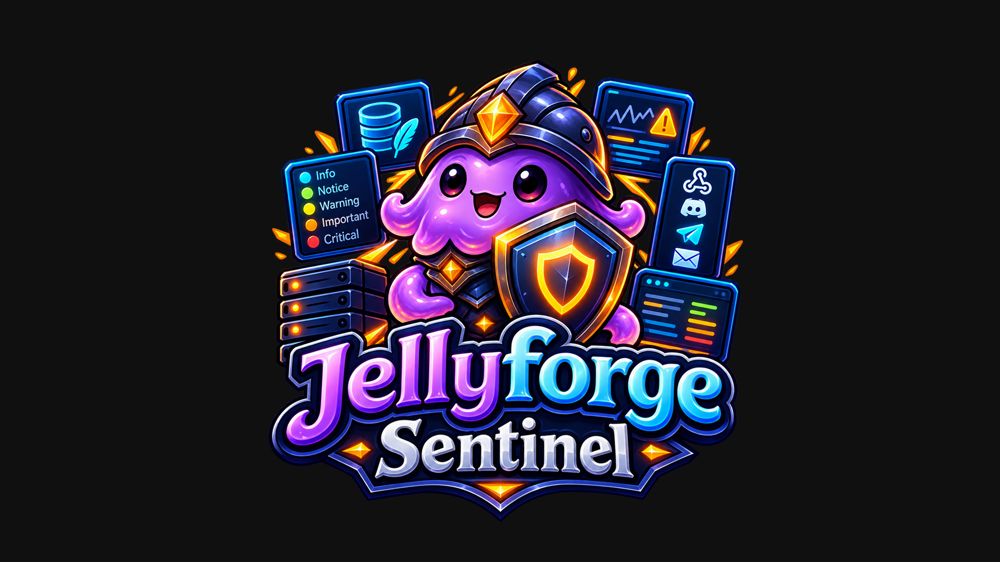

  

<h1 align="center">Jellyfin Sentinel</h1>

  Evidence-based root-cause diagnosis for Jellyfin playback problems.

Sentinel watches Jellyfin playback sessions and explains — with evidence, not guesses — why a
specific transcode or playback problem happened, tracks it as a deduplicated incident, and
(in a later milestone) can notify you about it.

**Status:** early development / pre-release. The Playback Doctor core (collector, rule engine,
SQLite persistence) is implemented and unit-tested. `v0.1.0-alpha` was installed on a real
Jellyfin 12.1 server and failed to load (native SQLite library loading bug); `v0.1.1.0` fixes
that, verified by code inspection and a clean local build/test run, but **not yet confirmed on a
real server**. There is no admin dashboard or notification delivery yet — diagnoses are
currently only visible by inspecting Sentinel's own SQLite database directly. See
[`SETUP.md`](./SETUP.md) before installing.

## What it does today

- Observes finished playback sessions (`ISessionManager.PlaybackStopped`)
- Runs each session through a deterministic rule engine built on Jellyfin's own `TranscodeReason`
  flags — no guessing, no AI, just the data Jellyfin already has
- Recognizes: unsupported video/audio codec, unsupported container, unsupported secondary audio
  track, too many streams, and the case where Jellyfin transcoded but didn't record why
- Cross-references a small, curated list of known Jellyfin core bugs, so Sentinel can say "this is
  a known upstream issue, not your configuration" where that's actually true
- Persists every observed session and diagnosis to its own SQLite database, fully separate from
  Jellyfin's own database

## What it doesn't do yet

Dashboard UI, notifications (Discord/Telegram/Email/webhook), library health checks, client
compatibility tracking, and AI-generated explanations are all deliberately out of scope for this
first milestone — see the roadmap in the master plan below for why, and when.

## Documentation

- [`SETUP.md`](./SETUP.md) — how to install and what to expect right now
- [`JELLYFIN_SENTINEL_MASTER_PLAN.md`](./JELLYFIN_SENTINEL_MASTER_PLAN.md) — full architecture,
  data model, and phased roadmap
- [`JELLYFIN_ECOSYSTEM_GAP_ANALYSIS.md`](./JELLYFIN_ECOSYSTEM_GAP_ANALYSIS.md) — the ecosystem
  research behind the product decisions

## License

GPL-3.0 — see [`LICENSE`](./LICENSE). Sentinel links against Jellyfin's `GPL-3.0-only`
NuGet packages (`Jellyfin.Controller`, `Jellyfin.Model`), so the compiled plugin is bound by
GPLv3 regardless of the repository license; GPL-3.0 is used here to make that explicit.
